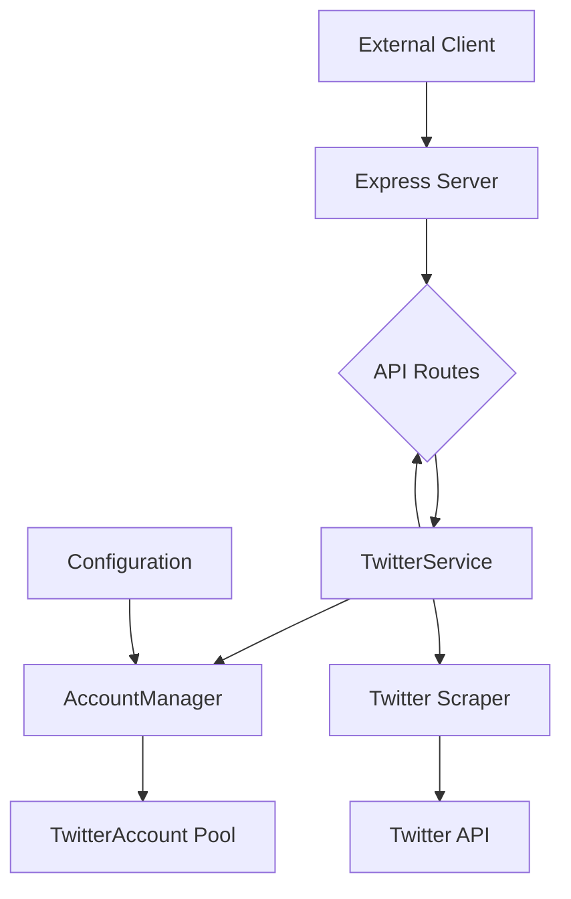

# Twitter API Wrapper

This is a robust, highly available Twitter API wrapper built with Node.js, Express, and TypeScript. It uses a pool of Twitter accounts to distribute requests, handle rate limits intelligently, and ensure high availability.

## Features

- **Account Pooling**: Manages a pool of Twitter accounts to distribute API requests.
- **Intelligent Account Selection**: Chooses the best available account for each operation based on health and rate limit status.
- **Automatic Health Monitoring**: Tracks the success/failure rate of each account and automatically disables unreliable accounts.
- **Rate Limit Management**: Aware of Twitter's rate limits and intelligently waits or switches accounts to avoid them.
- **Resilient**: If an account is rate-limited, locked, or fails, the system automatically switches to a healthy account.
- **Extensible**: The service-oriented architecture makes it easy to add new features and endpoints.
- **Dockerized**: Comes with a `Dockerfile` and `docker-compose.yml` for easy setup and deployment.
- **Persistent State**: Uses a SQLite database to persist account health and rate limit status across restarts.
- **Dynamic Management**: Add and remove accounts on-the-fly via API endpoints.
- **Secure**: Protects all endpoints with API key authentication.

## Architecture

The application is designed with a clear separation of concerns, making it easy to understand, maintain, and extend.



For a deeper understanding of the architecture and core concepts, please refer to the detailed explanation above.

## Getting Started

### Prerequisites

- Node.js (v16 or higher)
- pnpm (or npm/yarn)
- Docker (optional, for containerized deployment)

### Installation

1.  **Clone the repository:**
    ```bash
    git clone <repository-url>
    cd twitter-api-wrapper
    ```

2.  **Install dependencies:**
    ```bash
    pnpm install
    ```

3.  **Configure the application:**
    Create a `.env` file in the root of the project. You can copy `.env.example` to get started. Fill it out with your details.
    
    **` .env `**
    ```env
    # --- Server Configuration ---
    PORT=3000

    # --- Security ---
    # Generate a secure random string for the API key
    API_KEY=your-secret-api-key

    # --- Database and Seeding ---
    # Path to the SQLite database file
    DATABASE_PATH=state.db

    # Path to the JSON file for seeding the database on first run
    ACCOUNTS_FILE_PATH=accounts.json
    ```

4.  **Create a seed file (optional):**
    If you want to pre-populate the database with accounts, create an `accounts.json` file in the root of the project. This file will only be used the very first time you run the application when the database is empty.
    
    **` accounts.json `**
    ```json
    [
      {
        "username": "user1",
        "password": "password1",
        "email": "email1@example.com",
        "priority": 1
      },
      {
        "username": "user2",
        "password": "password2",
        "email": "email2@example.com",
        "priority": 2
      }
    ]
    ```

### Running the Application

-   **Development Mode:**
    ```bash
    pnpm dev
    ```
    This will start the server with hot-reloading.

-   **Production Mode:**
    ```bash
    pnpm build
    pnpm start
    ```

-   **With Docker:**
    ```bash
    docker-compose up -d
    ```

## API Reference

All endpoints are prefixed with `/api` and require an `X-API-Key` header with your secret API key.

### Health

-   **`GET /health`**:
    -   **Description**: Checks the health of the service.
    -   **Response**: `200 OK` with `{ "status": "ok" }`

### Accounts

-   **`GET /accounts/status`**:
    -   **Description**: Get the status of all managed Twitter accounts.
    -   **Response**: `200 OK` with a list of account statuses.

-   **`POST /accounts/enable/:username`**:
    -   **Description**: Enable a specific account.
    -   **Response**: `200 OK` with a success message.

-   **`POST /accounts/disable/:username`**:
    -   **Description**: Disable a specific account.
    -   **Response**: `200 OK` with a success message.

-   **`POST /accounts`**:
    -   **Description**: Add a new account to the pool.
    -   **Body**: `TwitterAccountConfig` JSON object.
    -   **Response**: `201 Created` with a success message.
    
-   **`DELETE /accounts/:username`**:
    -   **Description**: Remove an account from the pool.
    -   **Response**: `200 OK` with a success message.

### Authentication

-   **`POST /auth/login`**:
    -   **Description**: Log in to Twitter with the best available account.
    -   **Response**: `200 OK` with a success message.

-   **`POST /auth/logout`**:
    -   **Description**: Log out of all Twitter accounts.
    -   **Response**: `200 OK` with a success message.

-   **`GET /auth/status`**:
    -   **Description**: Check if any account is currently logged in.
    -   **Response**: `200 OK` with a boolean status.

### Profiles

-   **`GET /profiles/:username`**:
    -   **Description**: Get the profile of a Twitter user.
    -   **Response**: `200 OK` with the user's profile data.

### Tweets
@
-   **`GET /tweets/:id`**:
    -   **Description**: Get a single tweet by its ID.
    -   **Response**: `200 OK` with the tweet data.

-   **`GET /tweets/user/:username`**:
    -   **Description**: Get tweets for a specific user.
    -   **Query Params**: `maxTweets` (number, optional)
    -   **Response**: `200 OK` with a list of tweets.

### Search

-   **`GET /search`**:
    -   **Description**: Search for tweets.
    -   **Query Params**: `q` (string, required), `maxTweets` (number, optional)
    -   **Response**: `200 OK` with a list of matching tweets. 